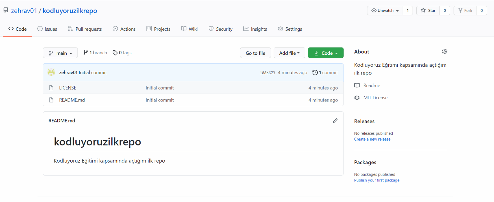

# kodluyoruzilkrepo
Kodluyoruz Eğitimi kapsamında açtığım ilk repo, içerisinde bir adet README.md ve bir adet index.html dosyası bulundurur.



## Kurulum

```bash
git clone https://github.com/zehrav01/kodluyoruzilkrepo.git
```
## License
[MIT](https://choosealicense.com/licenses/mit/)